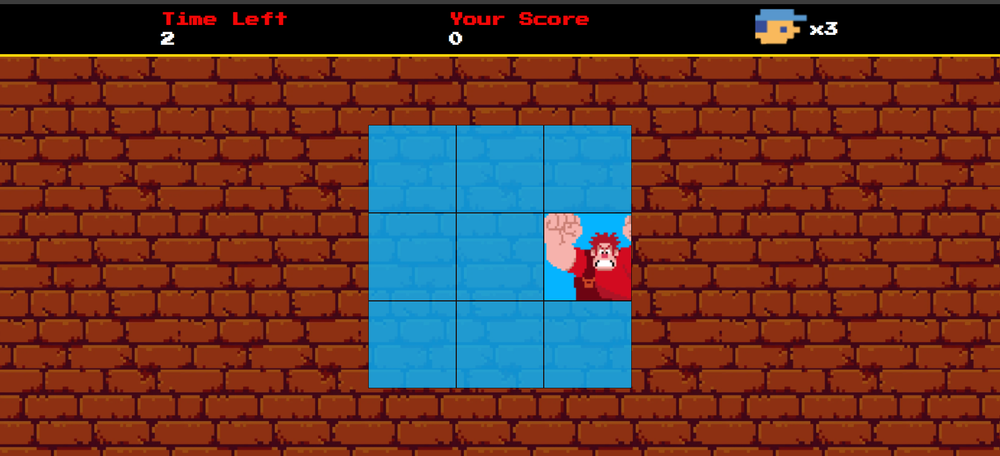

# Detona Ralph

## Descrição do Projeto



O projeto consiste em um website básico desenvolvido com as tecnologias web fundamentais: HTML, CSS e JavaScript. Este repositório contém os arquivos e o código-fonte necessários para criar e visualizar o site.


### Como Visualizar o Projeto

Para visualizar o projeto localmente, siga os passos abaixo:

1. Clone este repositório para o seu ambiente de desenvolvimento:

```bash git clone https://github.com/Douglas10009/Detona-Ralph```

2. Abra o arquivo index.html em um navegador da web.

ou

1. Acesse o https://douglas10009.github.io/Detona-Ralph/

### Funcionalidades Principais

O site possui as seguintes funcionalidades básicas:

- **Estrutura HTML Semântica**: Utilização adequada das tags HTML para garantir uma estrutura semântica.

- **Estilo com CSS**: Aplicação de estilos usando a pasta `src/style/` para tornar a interface atraente e responsiva.

- **Interatividade com JavaScript**: A pasta `src/scripts/` contém scripts JavaScript para adicionar interatividade à página.

### Contribuições

Contribuições são bem-vindas! Se você encontrar problemas, bugs ou tiver sugestões de melhorias, sinta-se à vontade para abrir uma _issue_ ou enviar um _pull request_.

### Licença

Este projeto é distribuído sob a licença [MIT](LICENSE), que você pode encontrar [aqui](LICENSE).

